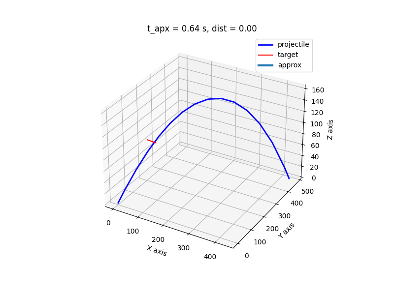

# FCS
Based on the target's position and velocity information,
it calculates the aiming data required to make the projectile collide with the target.

## Input Data
The specifications for the projectile are as follows:
- Initial velocity ($V_0$)
- Mass ($m$)
- Forward-projecting area ($A$)
- Drag coefficient ($C_D$)
- Type of drag ($I = 0\ {\rm or}\ 1$)

The target specifications are as follows:
- position ($\vec{r_0}$)
- Velocity (${\vec{d}}$)

Additionally, the parameters related to air resistance are as follows:
- Standard density ($D_0 = 1.225\ {\rm kg/m^3}$)
- Standard temperature ($T_0 = 288.15\ {\rm K}$)
- Lapse rate ($L = 0.0065$)
- Scale height ($h_0 = 5.256$)

Air density is expressed according to the International Standard Atmosphere (ISA) model 
using the following equation:
```math
D(z) = D_0 \left( 1 - \frac{Lz}{T_0} \right) ^{h_0}
```
When initial velocity and mass are kept constant, the trajectory changes as shown in the following graph when multiple conditions are altered.


## Output Data
Two angles, $(\phi, \theta)$ representing the aiming direction are output.
- Azimuth $(\phi: -\pi \leq \phi \leq \pi)$
- Elevation $(\theta: -\pi/2 \leq \theta \leq \pi/2)$
- Distance
- ETA time (msec)
- Calculation time (msec)

## Installation
If you can use `uv`, you can install by following command:
```shell
$ uv sync
```

## Usage
If you can use `uv`, you can run following command:
```shell
$ uv run lead 0.1 0.001 0.1 300 100 100 100 -10 1 0
46.95 40.98 0.00 642.33 43.00
``` 
or not:
```shell
$ python .\src\fcs\main.py 0.1 0.001 0.1 300 100 100 100 -10 1 0
46.95 40.98 0.00 642.33 43.00
``` 
Adding the `-r` (`--readable`) option will output the results in a more human-readable format.
```shell
$ lead -r 0.1 0.001 0.1 300 100 100 100 -10 1 0
phi: 46.95°, theta: 40.98°, dist: 0.00, eta_time: 642.33 ms, calc_time: 35.51 ms
``` 
Adding the `--plot` option will show trajectory of projectile and target.
```shell
$ lead --plot 0.1 0.001 0.1 300 100 100 100 -10 1 0
46.95 40.98 0.00 642.33 43.00
``` 


## Procedure
Follow these steps to aim.
1. Set initial angles ($\phi_0, \theta_0$)
2. Calculate the trajectory based on two angle measurements and the input data.
3. Calculate the closest distance between the projectile and the target.
4. Optimize the two angles to minimize this distance (Repeat steps 2 and 3).
   
### 1. Set initial angles
Any method that allows for rough targeting is acceptable. Here, the angle is determined using the target's current coordinates.
```math
\begin{align}
\phi_0 &= \arctan \left( \frac{r_{0y}}{r_{0x}} \right)\\
\theta_0 &= \arctan \left( \frac{r_{0z}}{\sqrt{r_{0x}^2 + r_{0y}^2}} \right)
\end{align}
```

### 2. Calculate the trajectory
Solving the following equation will reveal the $t_{\rm apx}$ when the projectile and target are closest to each other.
```math
\begin{align}
\vec{r_0} + t\vec{d} = t\vec{V_0} - \vec{F}
\end{align}
```
where $\vec{F}$ represents the vector of the total force acting on the projectile. The right side represents the target's predicted trajectory, while the left side represents the projectile's trajectory. If forces other than gravity are ignored, or if air resistance (frictional resistance) is proportional to velocity, this equation can be solved analytically. However, in reality, due to various effects, $\vec{F}$ takes on a complex form and cannot be solved analytically.  
Therefore, numerically solve the following system of first-order ordinary differential equations:
```math
\begin{align}
\frac{d\vec{S}}{dt} = \frac{d}{dt}
\begin{pmatrix}
x \\
y \\
z \\
v_x \\
v_y \\
v_z
\end{pmatrix} = 
\begin{pmatrix}
v_x \\
v_y \\
v_z \\
-Cv_x \\
-Cv_y \\
-Cv_z - g/m
\end{pmatrix}
\end{align}
```
where $C$ is the air resistance coefficient and follows the following equation.
```math
C = \frac{AC_DD(z)|\vec{v}|^{I}}{2m}
```
Use the following values as the initial conditions for the differential equation:
```math
\begin{align}
\vec{S}_0 = 
\begin{pmatrix}
-r_x \\
-r_y \\
-r_z \\
-d_x + V_0\cos{\theta_0}\cos{\phi_0} \\
-d_y + V_0\cos{\theta_0}\sin{\phi_0} \\
-d_z + V_0\cos{\theta_0}
\end{pmatrix}
\end{align}
```

### 3. Calculate the closest point
Solving the above differential equation yields the trajectory of the projectile. However, this is a discrete set of points $\vec{B}_n$ obtained through numerical analysis, and its minimum value $\tilde{\delta}$ is not the true closest distance. Since the trajectory of the projectile cannot be expressed analytically, to find the true closest distance $\delta$, it is necessary to approximate the trajectory near $\tilde{\delta}$ using an analytical function. Here, we will approximate it using a quadratic function.
For simplicity, we assume the trajectory of the projectile $\vec{B'}(t)$ lies entirely within the $x'z$ plane. In this case, the transformation equations between the $xyz$ coordinate system and the $x'y'z'$ coordinate system are as follows.
```math
\begin{align}
\begin{pmatrix}
x' \\
y' \\
z'
\end{pmatrix} &= R_z(-\tilde{\phi})
\begin{pmatrix}
x \\
y \\
z
\end{pmatrix}\\
&= \begin{pmatrix}
\cos\tilde{\phi} & \sin\tilde{\phi} & 0\\
-\sin\tilde{\phi} & \cos\tilde{\phi} & 0\\
0 & 0 & 1
\end{pmatrix}
\begin{pmatrix}
x \\
y \\
z
\end{pmatrix}
\end{align}
```
where $R_z(\tilde{\phi})$ is the rotation matrix about the $z$-axis, and $\tilde{\phi}$ is expressed using $\tilde{\vec{r}}_n$, the result of numerical computation, in the following equation.
```math
\tilde{\phi} = \frac{1}{N} \sum_{i=0}^{N} \arctan \left( \frac{B'_y(\tilde{t}_n)}{B'_x(\tilde{t}_n)} \right)
```
In this $xyz$ coordinate system, we approximate the trajectory near $\tilde{t}_n$ as follows:
```math
\begin{align}
\vec{B'}(t) =
\begin{pmatrix}
x'(t) \\
y'(t) \\
z'(t)
\end{pmatrix}
\approx 
\begin{pmatrix}
a_xt^2 + b_xt + c_x\\
0 \\
a_zt^2 + b_zt + c_z
\end{pmatrix}
\end{align}
```
Similarly, if we denote the predicted trajectory $\vec{T}$ of the target in the $x'y'z'$ coordinate system as $\vec{T'}$, the problem of finding $\delta$ reduces to the following minimization problem.
```math
\begin{align}
\delta &= \min_t \left| \vec{B'}(t) - \vec{T'}(t)\right| \\

&= \min_t \left|
\begin{pmatrix}
x'(t) \\
y'(t) \\
z'(t)
\end{pmatrix}
- R_z(-\tilde{\phi})\left[ t\vec{d} + \vec{r}_0\right]\right| \\

&= \min_t \left|
\begin{pmatrix}
a_xt^2 + b_xt + c_x\\
0 \\
a_zt^2 + b_zt + c_z
\end{pmatrix} - R_z(-\tilde{\phi})\left[
\begin{pmatrix}
d_x \\
d_y \\
d_z
\end{pmatrix}
t + 
\begin{pmatrix}
r_{0x} \\
r_{0x} \\
r_{0x}
\end{pmatrix}
\right]\right| \\

&= \min_t \left|
\begin{array}{rrr}
a_x t^2 & +\left( b_x - d_x \cos \phi - d_y \sin \phi \right)t & +(c_x - r_{0x} \cos \phi - r_{0y} \sin \phi) \\
& \left(d_x \sin \phi - d_y \cos \phi \right)t & +(r_{0x} \sin \phi - r_{0y} \cos \phi) \\
a_z t^2 & + \left(b_z - d_z \right)t & + \left(c_z - r_{0z}\right)
\end{array}
\right|
\end{align}
```
Since $a_x^2 + a_z^2 > 0$, this is equivalent to finding the minimum value of a quartic function.

### 4. Optimize the two angles
In simple terms, what we are doing in steps 2 and 3 is determining the closest distance $\delta$ when a projectile is launched at two angles, $\phi$ and $\theta$. Therefore, Eq. (9) above can be rewritten by adding phi and theta as arguments as follows.
```math
\begin{align}
\delta(\phi, \theta) &= \min_t \left| \vec{B'}(t, \phi, \theta) - \vec{T'}(t)\right|
\end{align}
```
Ultimately, we seek the launch angles $\phi_{\rm apx}$ and $\theta_{\rm apx}$ that minimize the distance $\delta$ between the projectile and the target, which reduces to the following minimization problem.
```math
\begin{align}
\delta_{\rm apx} &= \delta(\phi_{\rm apx}, \theta_{\rm apx})\\
&= \min_{\phi, \theta} \delta(\phi, \theta)\\
&= \min_{\phi, \theta} \min_t \left| \vec{B'}(t, \phi, \theta) - \vec{T'}(t)\right|
\end{align}
```