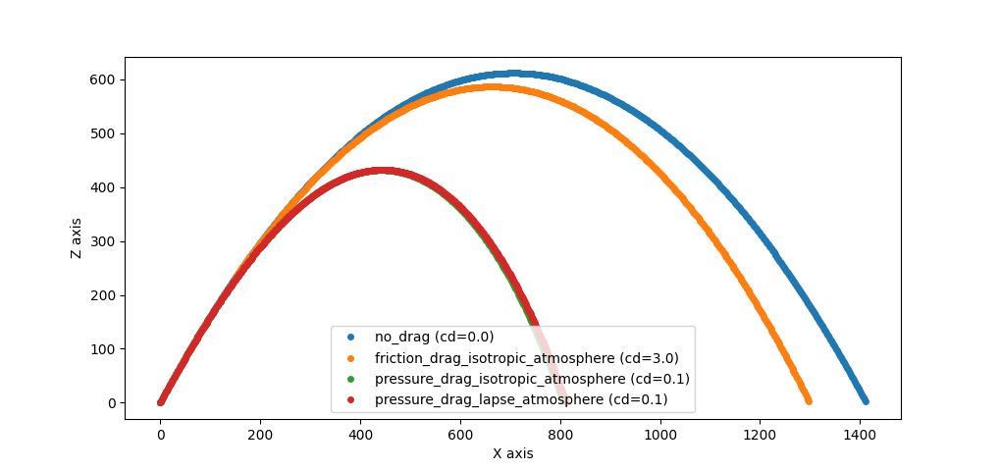

# FCS
Based on the target's position and velocity information,
it calculates the aiming data required to make the projectile collide with the target.

## Input Data
The specifications for the projectile are as follows:
- Initial velocity ($V_0$)
- Mass ($m$)
- Forward-projecting area ($a$)
- Drag coefficient ($C_D$)
- Type of drag ($I = 0\ {\rm or}\ 1$)

The target specifications are as follows:
- position ($r_0$)
- Velocity ($d$)

Additionally, the parameters related to air resistance are as follows:
- Standard density ($D_0 = 1.225\ {\rm kg/m^3}$)
- Standard temperature ($T_0 = 288.15\ {\rm K}$)
- Lapse rate ($L = 0.0065$)
- Scale height ($h_0 = 5.256$)

Air density is expressed according to the International Standard Atmosphere (ISA) model 
using the following equation:
```math
D(z) = D_0 * \left( 1 - \frac{Lz}{T_0} \right) ^{h_0}
```
When initial velocity and mass are kept constant, the trajectory changes as shown in the following graph when multiple conditions are altered.
